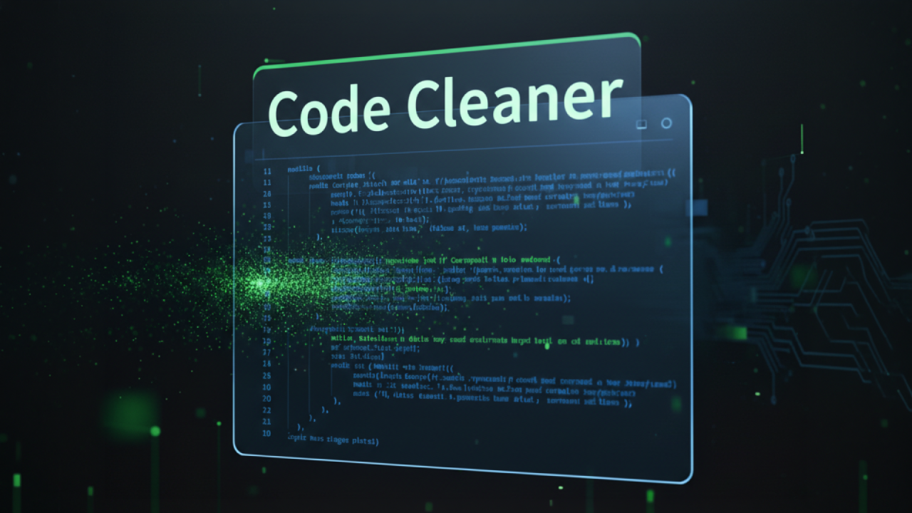

# 🛠️ Code Cleaner

**Professional AI-Powered Code Sanitization Utility**

Code Cleaner is a high-precision tool designed for developers who frequently copy snippets from terminals, PDF guides, or legacy documentation. It leverages a **hybrid sanitization pipeline**—combining deterministic Regex for rapid line-number stripping with the reasoning power of **Gemma 4** to detect and repair deep terminal-induced syntax corruption.



## ✨ Key Features

### 🧠 Hybrid Surgical Repair Pipeline
To ensure maximum speed and absolute structural integrity, Code Cleaner employs a two-stage process:
1. **Deterministic Stage (Regex):** Instantly strips standard line numbers (and their associated padding) and normalizes whitespace artifacts like non-breaking spaces.
2. **Probabilistic Stage (Gemma 4 AI):** Analyzes the remaining code to repair complex "corruption" that regex cannot solve, such as:
    - **Unintended Line Wraps:** Fixing tags or statements split across lines due to terminal width.
    - **Fragmented Keywords:** Rejoining words split by newlines.
    - **Contextual Validation:** Ensuring that numeric constants are preserved while remaining artifacts are removed.

**Model Selection:**
- **Gemma 4 31B (Dense):** High-intelligence mode using advanced reasoning for the most complex structural repairs.
- **Gemma 4 26B (MoE):** Optimized for high-throughput, lightweight cleaning.


### 🔍 Visual Analysis Layer
The app provides a transparent "thinking" process:
- **Detection Highlighting:** The "AI Analysis" panel visually flags detected line numbers and artifacts before they are removed.
- **Interactive Diff View:** A professional side-by-side comparison shows exactly what the AI changed, with navigation controls to jump between different "hunks" of repairs.

### 🎨 Professional Developer Experience
- **Cobalt Theme:** A high-contrast, eye-friendly interface with full **Light/Dark mode** support.
- **Integrated Workflow:** Open files directly from your system, save cleaned results, and copy to the clipboard with one click.
- **Session History:** Track all cleaning activities and AI feedback within a single session.
- **Low-Latency UI:** Built with Electron for a native desktop experience, featuring debounced input handling for massive code snippets.

## 🚀 Getting Started

### Prerequisites
- [Node.js](https://nodejs.org/) (Latest LTS recommended)
- A **Gemini API Key** from [Google AI Studio](https://aistudio.google.com/app/apikey)

### Installation
```bash
# Clone the repository
git clone https://github.com/odsantos/gemma4-code-cleaner.git
cd gemma4-code-cleaner

# Install dependencies
npm install

# Launch the application
npm start
```

### How to Use
1. **Input:** Paste your "dirty" code into the **Input** panel.
2. **Clean:** Click **"Clean Only"** for a fast regex-based line number removal.
3. **Verify:** Click **"Verify & Repair with Gemma"** to trigger the AI analysis.
4. **Review:** Use the **AI Analysis** and **Result** panels to review the changes via the Diff view.
5. **Export:** Copy the clean code or save it directly to a file.

## 🛠️ Technical Architecture

- **Runtime:** Electron (Main & Renderer processes)
- **AI Integration:** `@google/genai` via secure IPC bridge.
- **State Management:** `electron-store` for persistent settings (API keys, model preferences).
- **Diffing Engine:** `diff` library for calculating word-level changes between original and repaired code.
- **Styling:** Vanilla CSS with CSS Variables for dynamic theme switching.

## 🏆 Gemma 4 Challenge Insights

For the Gemma 4 Challenge, this project demonstrates **Intentional Model Selection**:
- **Reasoning Mode:** By utilizing the 31B model's reasoning capabilities, the app can distinguish between a line number and a legitimate numeric constant in the code, preventing accidental data loss.
- **Efficiency:** The inclusion of the 26B MoE model ensures that the tool remains performant and responsive for users with simpler cleaning needs.
- **Human-in-the-Loop:** The Diff UI ensures that the AI is a collaborator, not a black box, allowing developers to validate every single character change.

## 🤝 Credits & Acknowledgments

This project was made possible through the following technologies and tools:
- **Models:** Primarily powered by the cloud-based `gemma-4-31b-it` model, with support from `gemma-4-26b-a4b-it`.
- **Development Tools:** Built using **Chrome Gemini AI Assistant**, the **Google Antigravity IDE**, and **Google AI Studio** (used for targeted debugging).

---
Developed by [Osvaldo Santos](https://github.com/odsantos)
